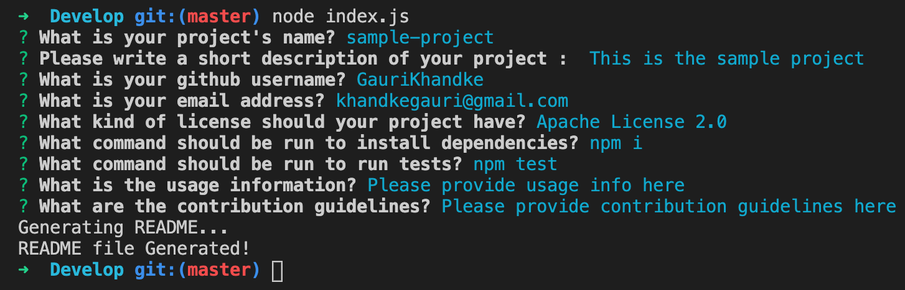
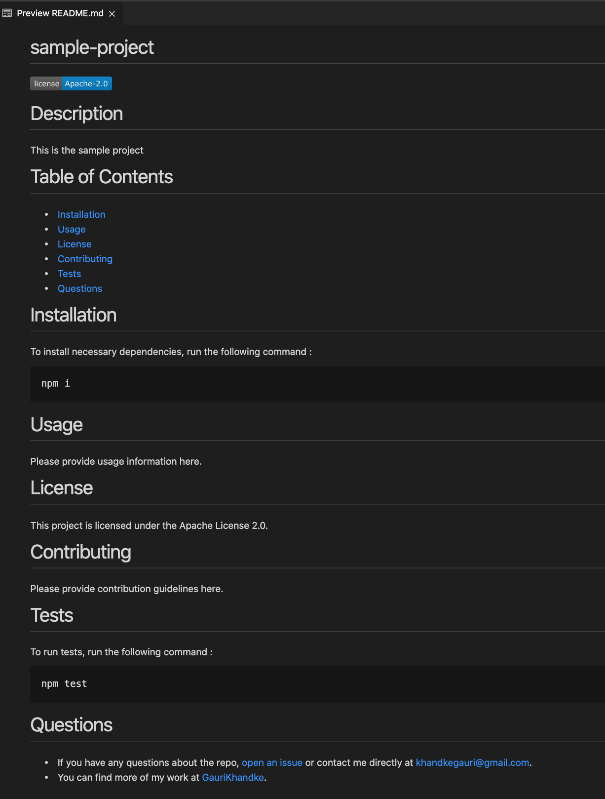

# Good-README-Generator


# Description

Good REAME Generator is a command-line application that dynamically generates a professional README.md from a user's input using the [Inquirer package](https://www.npmjs.com/package/inquirer).

# Motivation

* When creating an open source project on GitHub, it is important to have a quality README with information about the app--what is the app for, how to use the app, how to install it, how to report issues, and how to make contributions so that other developers are more likely to use and contribute to the success of the project. 
* A command-line application will allow for quick and easy generation of a project README to get started quickly. 
* This will allow a project creator to spend more time working on finishing the project and less time creating a good README.

# Demo


# Screenshots

|Terminal|Generated README.md file
|--|--
||

## User Story

```
AS A developer
I WANT a README generator
SO THAT can quickly create a professional README for a new project
```

# Technology

**1. [Node.js](https://nodejs.org/en/)** : 

Node.js is an open-source and cross-platform JavaScript runtime environment. A Node.js app is run in a single process, without creating a new thread for every request. Node.js provides a set of asynchronous I/O primitives in its standard library that prevent JavaScript code from blocking.

**2. [Inquirer npm package](https://www.npmjs.com/package/inquirer)** :

Inquirer.js strives to be an easily embeddable and beautiful command line interface for Node.js. 

# Installation 

* Navigate to the 'Develop' folder. To install necessary dependencies, run the following command :

```
npm i
```

* The application will be invoked with the following command:

```
node index.js
```

# Usage

* Run  commands listed in [Installation](#installation).
* Running `node index.js` command will prompt user series of questions about project repository, and based on the answers 'README.md' file will be generated.

# features : 

1. Uses Node.js to build application which generates README.md file dynamically by user's input.
2. Npm package '[Inquirer](https://www.npmjs.com/package/inquirer)' is used.

